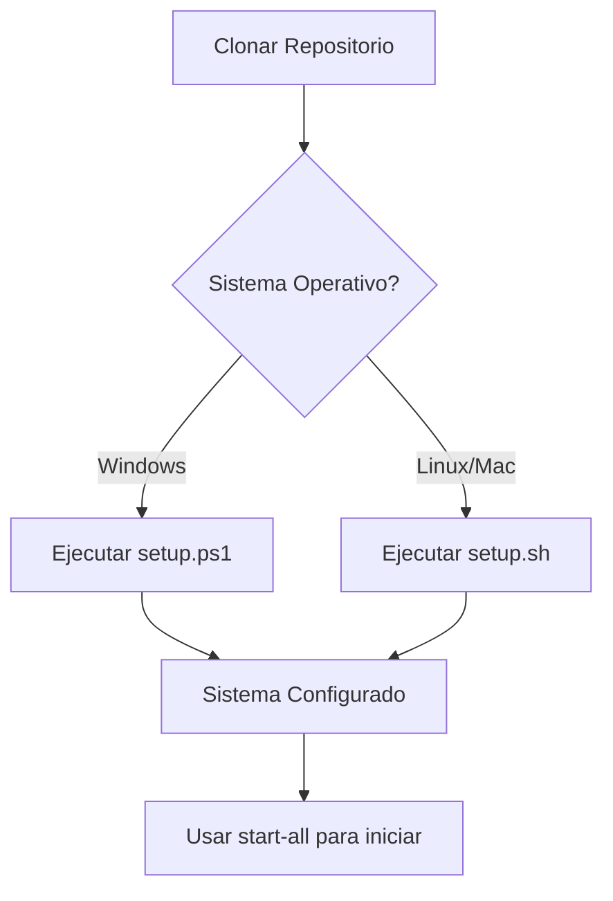
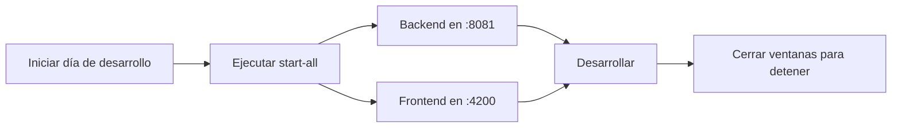

# 📋 Resumen de Scripts y Archivos

## ✅ Archivos Creados/Actualizados

### 🔧 Scripts del Backend

| Archivo | Plataforma | Propósito | Primera vez | Uso posterior |
|---------|-----------|-----------|-------------|---------------|
| **setup.ps1** | Windows (PowerShell) | Instalación completa automática | ✅ | ❌ |
| **setup.sh** | Linux/Mac (Bash) | Instalación completa automática | ✅ | ❌ |
| **setup-database.sh** | Linux/Mac | Solo configurar base de datos | ✅ | ⚠️ Si hay cambios en schema |
| **run_schema.bat** | Windows | Solo configurar base de datos | ✅ | ⚠️ Si hay cambios en schema |
| **start.bat** | Windows | Solo iniciar backend | ❌ | ✅ |
| **start.sh** | Linux/Mac | Solo iniciar backend | ❌ | ✅ |
| **SCRIPTS-README.md** | Todas | Documentación de scripts | 📖 | 📖 |

### 🎨 Scripts del Frontend

| Archivo | Plataforma | Propósito | Primera vez | Uso posterior |
|---------|-----------|-----------|-------------|---------------|
| **start.bat** | Windows | Iniciar frontend (instala deps si es necesario) | ✅ | ✅ |
| **start.sh** | Linux/Mac | Iniciar frontend (instala deps si es necesario) | ✅ | ✅ |

### 🌟 Scripts Maestros (Raíz del proyecto)

| Archivo | Plataforma | Propósito | Recomendado |
|---------|-----------|-----------|-------------|
| **start-all.bat** | Windows | Inicia backend + frontend simultáneamente | ✅ |
| **start-all.sh** | Linux/Mac | Inicia backend + frontend simultáneamente | ✅ |

### 📄 Documentación

| Archivo | Propósito |
|---------|-----------|
| **README.md** | Documentación principal del proyecto |
| **backend-SpringBoot/GestionDeEventos/SCRIPTS-README.md** | Guía detallada de scripts del backend |
| **backend-SpringBoot/GestionDeEventos/add_capacidad_column.sql** | Script SQL para migración manual del campo capacidad |

### 🐛 Correcciones de Código

| Archivo | Cambio Realizado |
|---------|------------------|
| **frontend-Angular/AngularFrontEnd/src/app/add-event/add-event.ts** | Agregada línea para cargar capacidad del evento al editar |

---

## 🎯 Flujo de Trabajo Recomendado

### Primera Instalación



### Uso Diario



---

## 🚀 Comandos Rápidos

### Windows

```powershell
# Primera vez (como Administrador)
cd backend-SpringBoot\GestionDeEventos
Set-ExecutionPolicy -ExecutionPolicy RemoteSigned -Scope CurrentUser
.\setup.ps1

# Uso diario (desde la raíz del proyecto)
.\start-all.bat
```

### Linux/Mac

```bash
# Primera vez
cd backend-SpringBoot/GestionDeEventos
chmod +x setup.sh setup-database.sh start.sh
./setup.sh

# Dar permisos a otros scripts
cd ../..
chmod +x start-all.sh
chmod +x frontend-Angular/AngularFrontEnd/start.sh

# Uso diario (desde la raíz del proyecto)
./start-all.sh
```

---

## 📊 Comparación de Scripts

### Para Backend

| Necesidad | Windows | Linux/Mac |
|-----------|---------|-----------|
| Primera instalación completa | `setup.ps1` | `setup.sh` |
| Solo actualizar BD | `run_schema.bat` | `setup-database.sh` |
| Solo ejecutar (sin instalar) | `start.bat` | `start.sh` |
| Comando directo | `mvnw.cmd spring-boot:run` | `./mvnw spring-boot:run` |

### Para Frontend

| Necesidad | Windows | Linux/Mac |
|-----------|---------|-----------|
| Iniciar (con npm install automático) | `start.bat` | `start.sh` |
| Comando directo | `npm start` | `npm start` |

### Para Sistema Completo

| Necesidad | Windows | Linux/Mac |
|-----------|---------|-----------|
| Iniciar backend + frontend | `start-all.bat` | `start-all.sh` |

---

## 🎓 Características de los Scripts

### setup.ps1 / setup.sh
- ✅ Detección automática del sistema operativo
- ✅ Instalación automática de Java JDK 21
- ✅ Instalación automática de PostgreSQL
- ✅ Creación de base de datos
- ✅ Ejecución de scripts SQL
- ✅ Compilación y ejecución del backend
- ✅ Manejo de errores robusto
- ✅ Opciones para saltar pasos (ej: -SkipJDK)

### run_schema.bat / setup-database.sh
- ✅ Lee la contraseña desde application.properties
- ✅ Crea la base de datos si no existe
- ✅ Ejecuta schema.sql
- ✅ Ejecuta inserts.sql (datos de prueba)
- ✅ Manejo de errores con mensajes claros

### start.bat / start.sh
- ✅ Navegación automática al directorio correcto
- ✅ Ejecución simple del backend
- ✅ Mensajes informativos

### start-all.bat / start-all.sh
- ✅ Inicia backend y frontend simultáneamente
- ✅ Ventanas/procesos separados para cada servicio
- ✅ Espera para que el backend inicie antes del frontend
- ✅ Manejo de señales para cerrar ambos servicios (Linux/Mac)
- ✅ Mensajes con URLs de acceso

---

## 🛠️ Personalización

### Cambiar Contraseña de PostgreSQL

Edita `application.properties`:
```properties
spring.datasource.password=tu_nueva_contraseña
```

Los scripts leerán automáticamente esta contraseña.

### Cambiar Puerto del Backend

Edita `application.properties`:
```properties
server.port=8082
```

Luego actualiza `API_BASE_URL` en el frontend (`src/app/config/api.config.ts`).

### Cambiar Puerto del Frontend

Edita `package.json`:
```json
"scripts": {
  "start": "ng serve --port 4201"
}
```

---

## 📞 Soporte

Si tienes problemas con algún script:

1. Verifica que tienes permisos de administrador (Windows) o sudo (Linux/Mac)
2. Lee los mensajes de error cuidadosamente
3. Consulta `SCRIPTS-README.md` en la carpeta del backend
4. Revisa la sección "Solución de Problemas" en el README principal

---

## ✨ Mejoras Implementadas

### Comparado con los scripts originales:

1. **Instalación automática de dependencias** (Java, PostgreSQL)
2. **Detección inteligente del sistema operativo**
3. **Lectura automática de contraseñas** desde application.properties
4. **Scripts unificados** para iniciar todo el sistema
5. **Instalación automática de npm** en scripts de frontend
6. **Manejo robusto de errores** con mensajes claros
7. **Documentación completa** con ejemplos
8. **Scripts de inicio rápido** para uso diario
9. **Opciones flexibles** (ej: -SkipJDK, -OnlyRun)
10. **Compatibilidad multiplataforma** mejorada

---

**¡Listo para desarrollar! 🚀**
